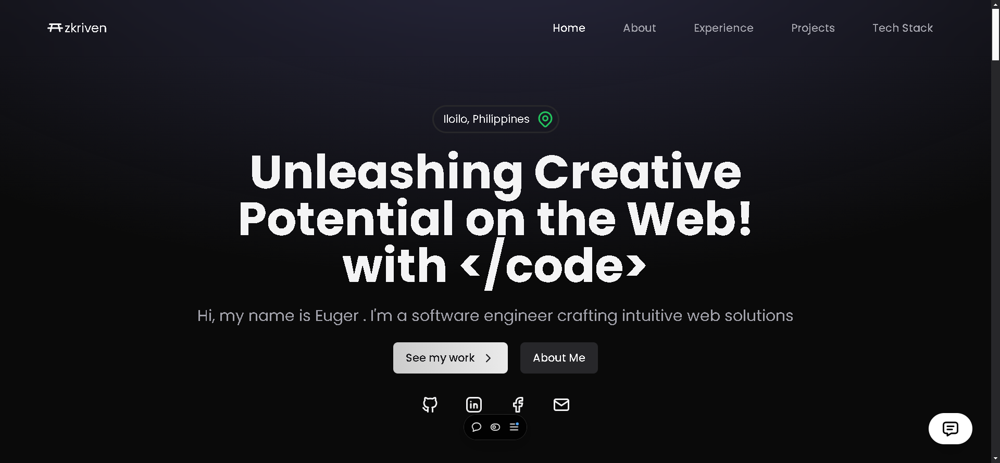
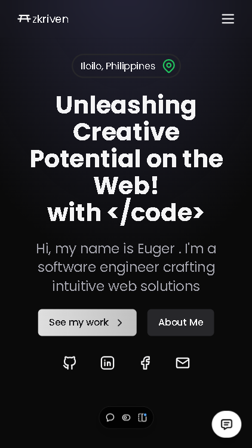

# Portfolio Website

This is my personal portfolio website built with Next.js, featuring a modern design, AI chatbot integration, and smooth animations.

If you like this portfolio template, feel free to use it for your own portfolio! Don't forget to ⭐ star this repository if you find it helpful.

## Screenshots

### Desktop View

### Mobile View

## Features

-   Modern and responsive design
-   AI chatbot assistant powered by OpenAI
-   Smooth page transitions and animations using Framer Motion
-   Dark themed
-   Project showcase section
-   Contact form with email integration
-   SEO optimized
-   Responsive images and layouts
-   TypeScript support

## Getting Started

1. Clone the repository
2. Install dependencies: `npm install`
3. Create a `.env` file and add your OpenAI API key and Google Generative AI API key
4. Start the development server: `npm run dev`
